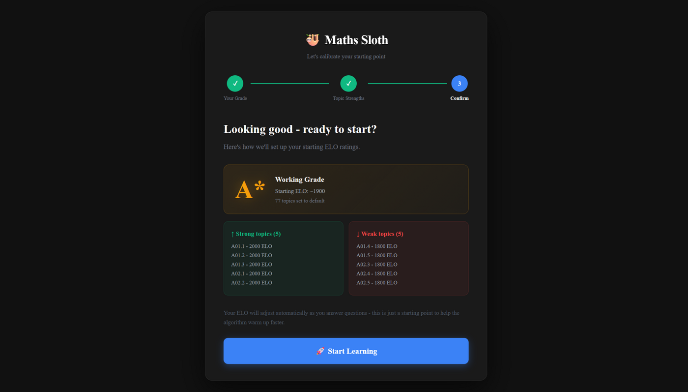
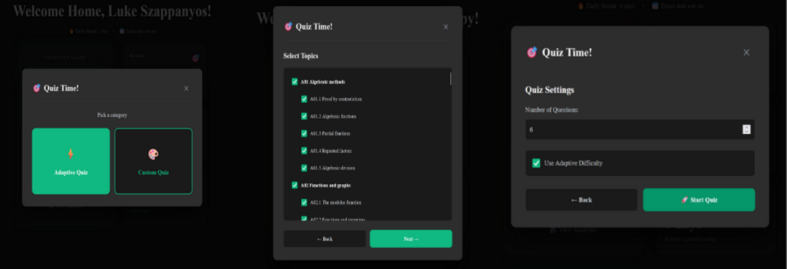
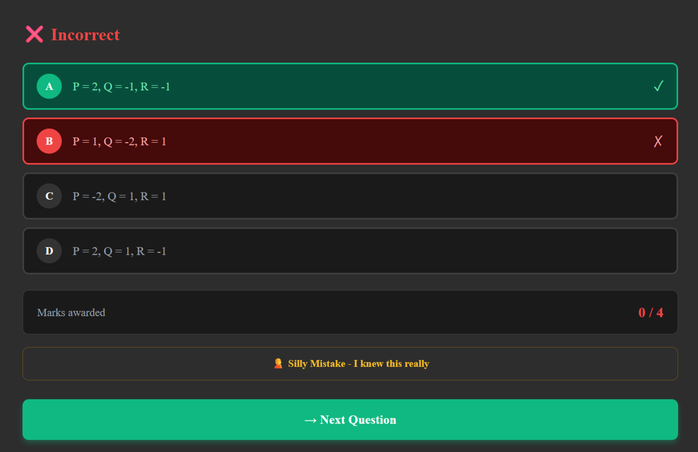
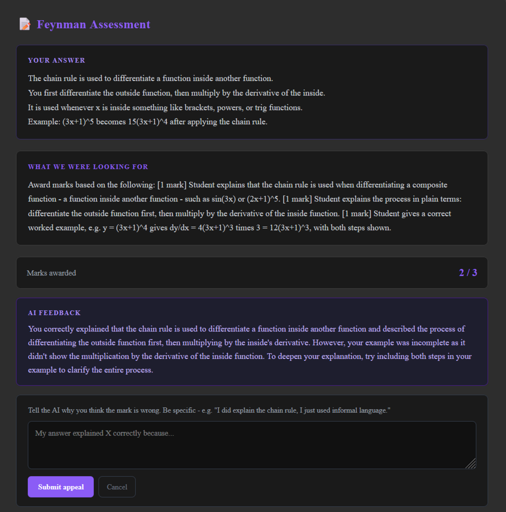
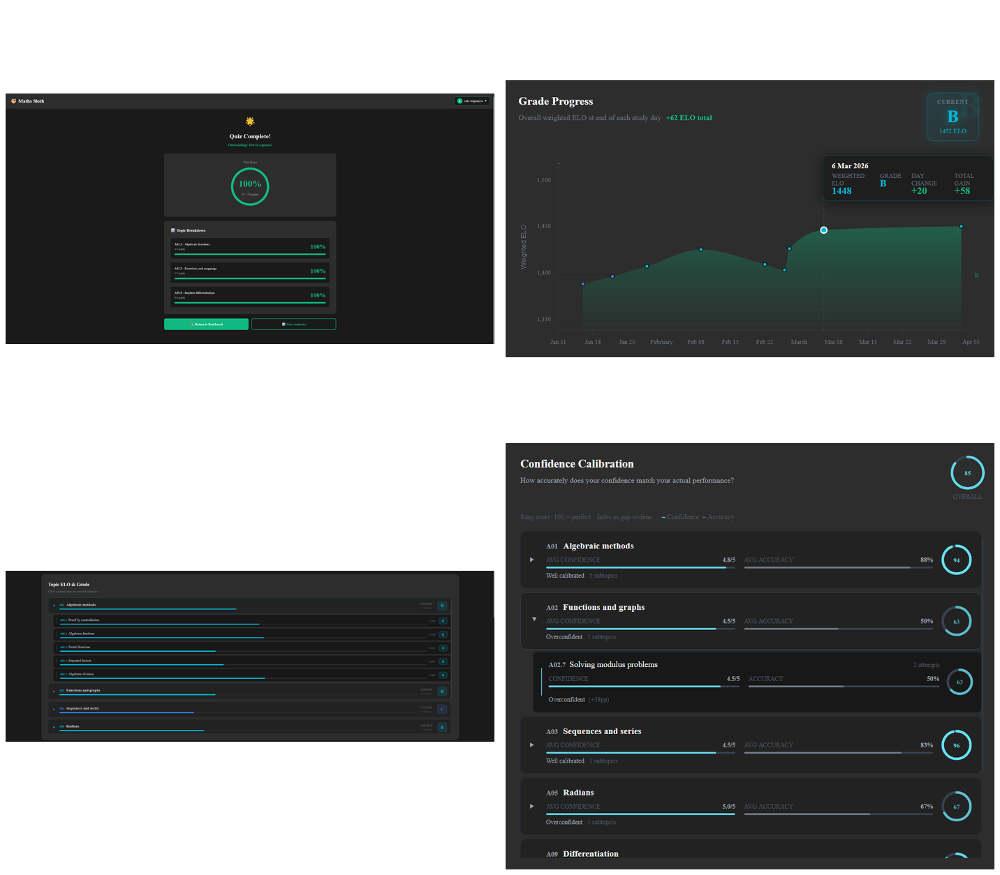
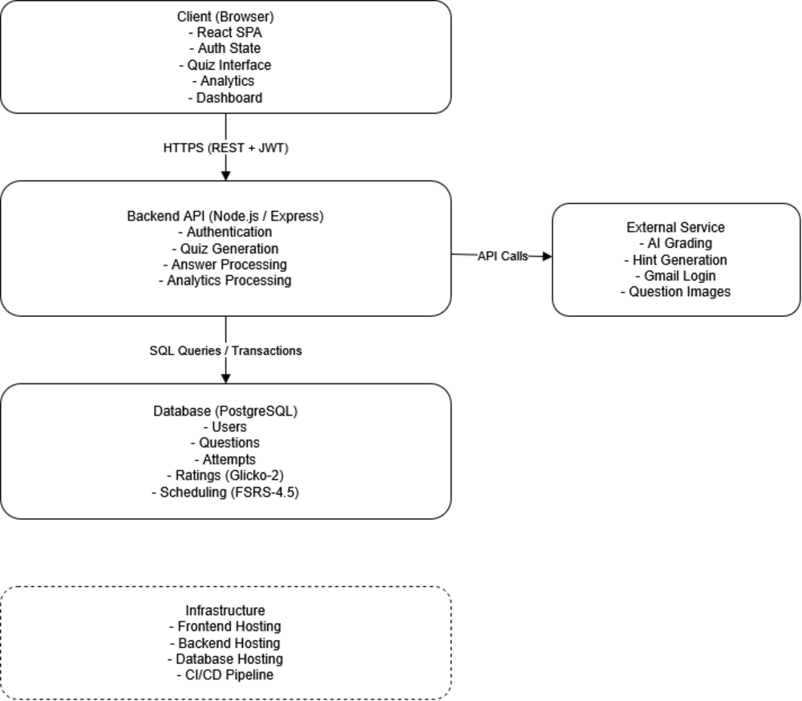

# 🦥 Maths Sloth

**An adaptive, AI-powered revision platform for A-level Mathematics, built on the same rating systems that power chess.com and Duolingo.**

Maths Sloth schedules every review with FSRS-4.5 (the algorithm behind modern Anki), tracks topic-level ability with the Glicko-2 rating system, and grades free-text explanations with GPT-4o-mini graded against human-tutor agreement.


[Highlights](#-highlights) · [Features](#-features) · [How It Works](#-how-it-works) · [Tech Stack](#-tech-stack) · [Evaluation](#-evaluation--results) · [Getting Started](#-getting-started)



---

## 📌 Highlights

- **97% grading agreement** between AI-assigned marks and an independent human tutor on free-text explanation answers (90% before appeal review), measured on a blind 30-answer test set.
- **Glicko-2 implemented from scratch** as an atomic PostgreSQL trigger, validated to within ±0.05 ELO of the published worked examples in Glickman (2013).
- **FSRS-4.5 spaced-repetition scheduling implemented from scratch**, the same algorithm used by modern Anki, driving per-topic review timing for 73 syllabus topics.
- **Custom four-pool adaptive selection algorithm** balancing FSRS urgency, Glicko-2 uncertainty, relative mastery gap and exam weighting, generating a tailored quiz in 300–500ms.
- **Evaluated, not just built**: a 25-person pre-development survey shaped the requirements, and 24 users tested the finished platform across two rounds of usability testing.
- **Grounded in the literature**: every major design decision traces back to a specific finding across 35 academic sources in cognitive psychology, psychometrics and educational technology (see [Grounded in Learning Science](#-grounded-in-learning-science)).

## 🎯 Overview

Most maths revision tools fall into one of two camps: static question banks with no personalisation (PhysicsAndMathsTutor, MathsGenie), or general-purpose spaced-repetition tools with no concept of mathematical problem-solving (Anki). None combine algorithmic scheduling, an uncertainty-aware ability model and AI-assisted feedback in one system.

Maths Sloth closes that gap. Every quiz session is generated by an adaptive algorithm that decides which of 73 A-level topics a student most needs to review right now, weighing how overdue a topic is, how confident the system is in its current estimate of the student's ability, how far that topic lags behind the student's own average, and how heavily it is weighted in the real exam. Answers are graded in one of three formats, including free-text Feynman-style explanations marked by an LLM calibrated to the student's own ability level, and every attempt feeds back into the scheduling and rating engine atomically at the database layer.

## ✨ Features

### Adaptive quiz engine
A four-pool selection algorithm assembles each quiz from the highest-priority topics first, falling back through overflow, never-attempted and cooldown-bypass pools so a student is never left without a quiz to take. Custom quizzes are also supported for manual, topic-by-topic revision.



### Three question formats, including AI-graded explanations
Multiple-choice and self-marked questions sit alongside Feynman-style questions, where students explain a concept in plain English and GPT-4o-mini grades the response against a rubric, calibration examples from other students, and a strictness band tied to the student's current ELO. Students can appeal a mark and trigger an independent re-grade.



| Strictness band | ELO range | Grading behaviour |
|---|---|---|
| Emerging | < 1200 | Generous; any genuine understanding is rewarded |
| Developing | 1200–1499 | Partial credit given freely; core idea is enough for full marks |
| Competent | 1500–1699 | Rubric applied fairly; core idea must be present and explained |
| Proficient | 1700–1899 | Clear mathematical language expected; vague reasoning loses marks |
| Mastery | ≥ 1900 | Rigorous marking; a thorough, well-structured explanation is required |

### AI-powered, progressive hints
Hints are generated from a live student profile (skill level, weak topics, preferred explanation style inferred from previously helpful hints, and typical hint length), then scaffolded across up to three requests per question without ever revealing the final answer.



### Analytics dashboard
A full picture of learning state: a grade-progress chart built on daily weighted-ELO snapshots, a topic radar chart, a confidence-calibration score that flags over- and under-confidence per topic, and a GitHub-style study-activity heatmap.



### Cold-start onboarding
A three-stage wizard lets a new student set a working grade and flag topics they already feel strong or weak in, bulk-seeding all 73 per-topic ELOs before their first quiz so the adaptive algorithm has a meaningful prior from session one, rather than assuming every student starts identically.

## ⚙️ How It Works

**Priority scoring.** Every topic is scored on each quiz generation:

```
priority = urgency × uncertainty × mastery_need × exam_weight

urgency        = clamp(0, 1, (1 − FSRS_retrievability) × state_multiplier)
                 state_multiplier: relearning = 1.5, learning = 1.2, else = 1.0
uncertainty    = sqrt(glicko_rd / 350)                 # softened Glicko-2 RD
mastery_need   = max(0.5, 1 + mastery_gap / −200)      # gap vs personal average
exam_weight    = topic's exam frequency weighting
```

**Four-pool selection.** Questions are drawn from the top-ranked topics first (Pool 1), then lower-priority topics (Pool 2), then topics the student has never attempted (Pool 3), then a relaxed-cooldown fallback (Pool 4), so quiz generation always succeeds regardless of session history.

**Atomic rating updates.** A single `BEFORE INSERT` trigger on `question_attempts` runs the full six-step Glicko-2 procedure (scale conversion, g-function, variance, performance delta, volatility via the Illinois algorithm, final rating) and synchronises FSRS-4.5 stability and difficulty, for every topic the question touches, in the same transaction as the attempt itself. If either update fails, the whole insert rolls back, so a graded attempt can never exist without a corresponding rating update.

**Question difficulty is alive.** Question ELOs are not hand-assigned. They drift with student performance, except for a set of anchor questions sourced from real past papers, whose fixed ratings keep the whole scale calibrated to genuine grade boundaries.

## 🏗️ Architecture



Maths Sloth is a three-tier client-server application: a React single-page app talking to a stateless Express REST API over JWT-authenticated HTTPS, backed by PostgreSQL for both relational data and the rating/scheduling logic itself.

## 🧰 Tech Stack

| Layer | Technology |
|---|---|
| **Frontend** | React 18, Vite 7, React Router 7, Tailwind CSS 4, visx and Chart.js (analytics), KaTeX (LaTeX rendering) |
| **Backend** | Node.js, Express 5, Passport.js (local + Google OAuth 2.0), JWT, bcrypt |
| **Database** | PostgreSQL, PL/pgSQL triggers for Glicko-2 and FSRS-4.5 |
| **AI / external services** | OpenAI GPT-4o-mini (Feynman grading and hints), Google OAuth 2.0, AWS S3 (question images), Nodemailer (email verification) |
| **Hosting** | Vercel (frontend), Render (API), Neon (Postgres), CI/CD via Vercel auto-build on push |

## 📊 Evaluation & Results

| Metric | Result |
|---|---|
| AI Feynman-grading agreement with a human tutor | 90% (97% after the appeal mechanism), 30-answer blind test |
| Hint helpfulness | 71% rated helpful overall, rising to 78% for progressive (2nd/3rd) hints |
| Adaptive quiz generation time | 300–500ms across 73 topics with full session history |
| Glicko-2 trigger update time | Under 20ms per topic, including the Illinois volatility solver |
| Requirements delivered | 18/18 Must/Should/Could-have requirements (MoSCoW), fully verified |
| User testing | 24 participants across two phases; 100% completed onboarding unaided; 21/24 completed a full adaptive quiz without issue |

Full functional testing was carried out per-endpoint with valid and invalid payloads, including edge cases such as generating quizzes when every topic is in cooldown and interrupting onboarding mid-flow.

## 📚 Grounded in Learning Science

Every major feature traces back to a specific research finding rather than intuition:

- **Spaced repetition** (Ebbinghaus's forgetting curve; FSRS) drives algorithmic, not manual, review scheduling.
- **The testing effect** (Roediger & Karpicke) justifies a quiz-first design with no passive lecture mode.
- **Interleaved practice** (Rohrer, Dedrick & Stershic) motivates cross-topic scheduling within a single session.
- **Desirable difficulties** (Bjork) and the **Zone of Proximal Development** (Vygotsky) inform the 65–75% target success rate and the scaffolded AI hint system.
- **The Feynman Technique and metacognition research** (Agarwal; Flavell) justify the free-explanation question format and the confidence-logging-before-feedback flow.
- **Behavioural friction research** (Behavioural Insights Team) motivates the single "Adaptive Quiz" button that removes manual topic selection entirely.

A pre-development survey of 25 A-level and GCSE Mathematics students (aged 15–21) directly shaped feature prioritisation: adaptive difficulty (4.8/5) and spaced repetition (4.6/5) were the most desired features, and poor progress visibility was the most cited frustration with existing tools.

## 🧠 Skills Demonstrated

- **Full-stack ownership**: React and Node/Express application designed, built and deployed end-to-end (Vercel, Render, Neon), with no boilerplate starter kit.
- **LLM integration and prompt engineering**: structured GPT-4o-mini grading and hint pipelines, calibration examples, ability-adaptive strictness bands and parsed structured output.
- **Algorithm design**: Glicko-2 and FSRS-4.5 implemented from first principles rather than an off-the-shelf library, plus a custom multi-factor priority and pooling algorithm.
- **Database engineering**: an 11-table relational schema with atomic PL/pgSQL triggers, CHECK constraints and cascading referential integrity.
- **Applied research**: a literature review synthesising 35 academic sources and a 25-person pre-development survey, directly mapped to requirements via MoSCoW prioritisation.
- **Evaluation methodology**: functional, performance and two-phase user testing (n=24), plus a blind accuracy test of the AI grading pipeline against a human tutor.

## 🚀 Getting Started

```bash
git clone https://github.com/Szzappy/MathsSloth.git
cd MathsSloth
```

**1. Database.** Create a PostgreSQL 16 database and run the schema:

```bash
psql -d your_database -f server/database.sql
```

**2. Backend.**

```bash
cd server
npm install
# create a .env file — see Environment variables below
npm run topicSeed        # seeds the 73-topic hierarchy
npm run questionsSeed    # seeds the question bank
npm run dev               # starts the API on nodemon
```

**3. Frontend** (in a separate terminal):

```bash
cd client
npm install
npm run dev
```

### Environment variables

`server/.env` needs credentials for PostgreSQL, JWT signing, OpenAI, Google OAuth, AWS S3 and outbound email, for example:

```
DATABASE_URL=
JWT_SECRET=
OPENAI_API_KEY=
GOOGLE_CLIENT_ID=
GOOGLE_CLIENT_SECRET=
AWS_ACCESS_KEY_ID=
AWS_SECRET_ACCESS_KEY=
AWS_REGION=
AWS_S3_BUCKET=
SMTP_HOST=
SMTP_USER=
SMTP_PASS=
CLIENT_URL=
```

`client/.env` needs the API base URL(s), for example `VITE_API_URL`. Check `server/index.js` for the exact variable names in use.

## 📁 Project Structure

```
MathsSloth/
├── client/                    # React 18 + Vite single-page app
│   └── src/                   # AuthContext / QuizContext, protected routes,
│                               # dashboard, quiz, analytics and onboarding pages
├── server/
│   ├── routes/                 # authRoutes, quizRoutes, analyticsRoutes,
│   │                            # dashboardRoutes, openai, wolfram
│   ├── seeds/                   # topicSeed, questionsSeed, resetSchema
│   ├── utils/                    # jwtGenerator
│   ├── database.sql              # full PostgreSQL schema and triggers
│   └── index.js                  # Express entry point
└── README.md
```

## 🗺️ Roadmap

- **Automated question ingestion**: an LLM-driven pipeline to expand the hand-authored question bank, with new questions self-calibrating through student performance.
- **Validated grade prediction**: compare platform ELO against real A-level results to calibrate the ELO-to-grade thresholds against ground truth rather than heuristics.
- **Opt-in social features**: anonymised percentile ranking and streak/ELO comparison among peers.


## 👤 Author

**Luke Szappanyos** - BSc Computer Science, First Class Honours, University of Warwick. Starting an MSc in Applied AI at WMG in September 2026.

[GitHub](https://github.com/Szzappy) · [LinkedIn](#) · [Portfolio](#)
